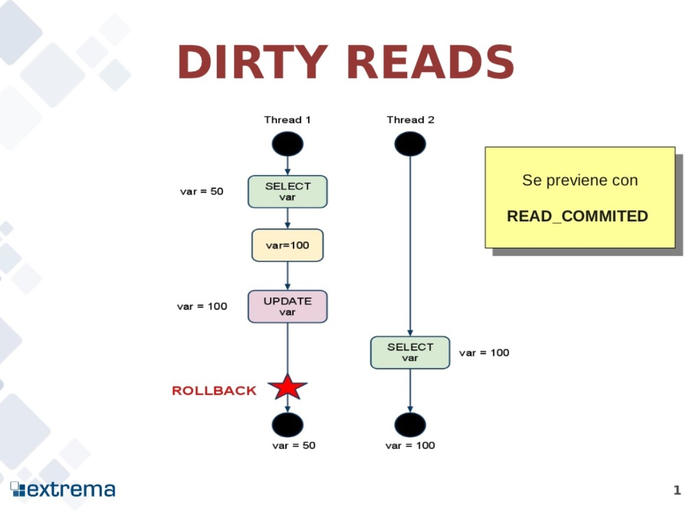

# 功能介绍

## 1. 加上适当的空格

在中文和英文数字之间加上空格可以大大提高文档的可读性，例如以下网站就根据了这一原则进行排版：

- [Laraval China](https://laravel-china.org/)
- [Apple](https://www.apple.com/cn/)
- [Microsoft](https://www.microsoft.com/zh-cn/)

### 1.1 未加空格

图a的第二列Has表示已拥有的资源数，第三列Max表示总共需要的资源数，Free表示还有可以使用的资源数。从图a开始出发，先让B拥有所需的所有资源，运行结束后释放B，此时Free变为4；接着以同样的方式运行C和A，使得所有进程都能成功运行，因此可以称图a所示的状态时安全的。

### 1.2 加上适当的空格

图 a 的第二列 Has 表示已拥有的资源数，第三列 Max 表示总共需要的资源数，Free 表示还有可以使用的资源数。从图 a 开始出发，先让 B 拥有所需的所有资源，运行结束后释放 B，此时 Free 变为 4；接着以同样的方式运行 C 和 A，使得所有进程都能成功运行，因此可以称图 a 所示的状态时安全的。

## 2. 图片引用转换

Markdown 文档可以使用 `` 这种方式来引用图片，但是无法设置大小。过大的图片会造成文档内容过于粗糙，图片大小的选取以图片内的文字和文档文字大约一致为宜，请比较以下两个示例：

### 2.1 过大的图片

T1 修改一个数据，T2 随后读取这个数据。如果 T1 撤销了这次修改，那么 T2 读取的数据是脏数据。

### 2.2 合适的图片

T1 修改一个数据，T2 随后读取这个数据。如果 T1 撤销了这次修改，那么 T2 读取的数据是脏数据。

# TODO

- 英文专有名词提示首字母大写
